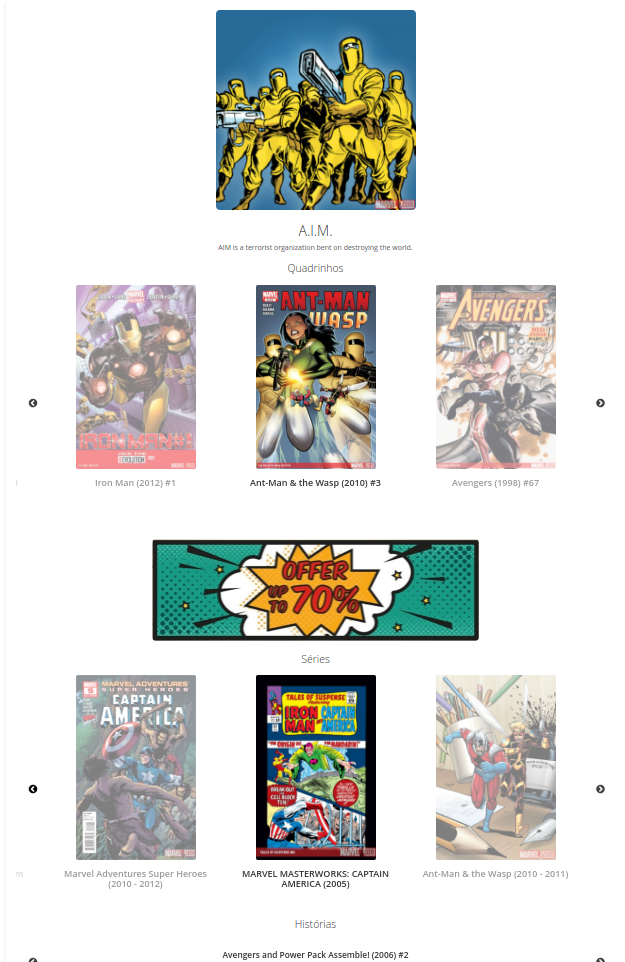
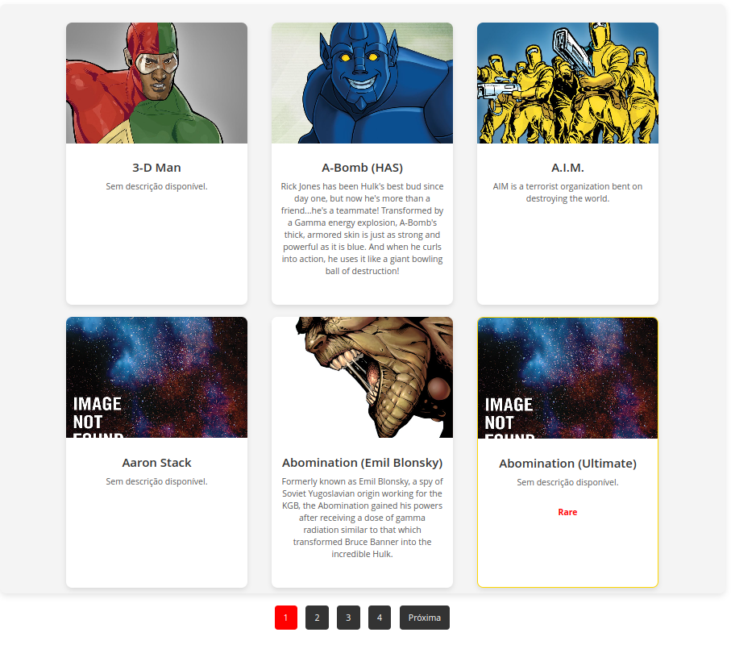

Marvel Characters Module

Descrição

Este módulo foi criado para exibir informações de personagens da API pública da Marvel Comics em uma página customizada no Magento 2. Ele utiliza dados como quadrinhos, séries, histórias e eventos relacionados aos personagens.

Funcionalidades

- Exibe detalhes de personagens da Marvel, incluindo nome, descrição e imagem.
- Carrega e exibe quadrinhos, séries, histórias e eventos relacionados ao personagem.
- Inclui carrosséis para exibir os dados de quadrinhos, séries, histórias e eventos.
- Banner promocional personalizado entre os carrosséis.

Tecnologias Usadas

- Magento 2: Framework principal para o desenvolvimento do módulo.
- Slick Carousel: Utilizado para exibir carrosséis de quadrinhos, séries, histórias e eventos.
- API da Marvel Comics: Fonte de dados dos personagens e suas informações.

Instalação

- Copie o módulo para o diretório app/code: Coloque o diretório Infobase/Marvel em app/code/Infobase/Marvel.

Dependências

- Magento: 2.4.7
- PHP: 7.4
- MySQL: 5.7
- Javascript
- LESS

## Imagens
### PDP

### PLP
